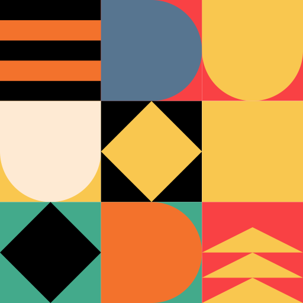

# Bauhaus Avatar Generator



A TypeScript library for generating beautiful, deterministic Bauhaus-style SVG avatars from any input string. Each input string will always generate the same unique avatar, making it perfect for user profiles, placeholders, and visual identification.

## Features

- 🎨 **Bauhaus-inspired design** - Clean, geometric shapes with bold colors
- 🔄 **Deterministic generation** - Same input always produces the same avatar
- 📱 **SVG output** - Scalable vector graphics that work everywhere
- 🎯 **TypeScript support** - Full type definitions included
- ⚡ **Zero dependencies** - Lightweight and fast
- 🎲 **Multiple palettes** - Beautiful color combinations inspired by Bauhaus art

## Installation

```bash
npm install bauhaus-avatar-generator
```

## Usage

### Basic Usage

```typescript
import { generateSVG } from "bauhaus-avatar-generator";

// Generate a 512x512 avatar
const avatar = generateSVG("john@example.com");
console.log(avatar);
```

### With Custom Size

```typescript
import { generateSVG } from "bauhaus-avatar-generator";

// Generate a 256x256 avatar
const avatar = generateSVG("alice", 256);
console.log(avatar);
```

### With Custom Color Palette

```typescript
import { generateSVG } from "bauhaus-avatar-generator";

// Define your own color palette
const customPalette = [
  "#FF6B6B", // Coral
  "#4ECDC4", // Teal
  "#45B7D1", // Blue
  "#96CEB4", // Mint
  "#FFEAA7", // Yellow
  "#DDA0DD", // Plum
  "#98D8C8", // Seafoam
  "#F7DC6F", // Gold
  "#BB8FCE", // Lavender
  "#85C1E9", // Sky blue
];

// Generate avatar with custom palette
const avatar = generateSVG("alice", 256, customPalette);
console.log(avatar);
```

### In HTML

```html
<!DOCTYPE html>
<html>
  <head>
    <title>Avatar Example</title>
  </head>
  <body>
    <div id="avatar"></div>

    <script type="module">
      import { generateSVG } from "bauhaus-avatar-generator";

      const avatar = generateSVG("user@example.com", 200);
      document.getElementById("avatar").innerHTML = avatar;
    </script>
  </body>
</html>
```

### In React

```tsx
import React from "react";
import { generateSVG } from "bauhaus-avatar-generator";

interface AvatarProps {
  input: string;
  size?: number;
  palette?: string[];
  className?: string;
}

const Avatar: React.FC<AvatarProps> = ({
  input,
  size = 200,
  palette,
  className,
}) => {
  const svg = generateSVG(input, size, palette);

  return (
    <div className={className} dangerouslySetInnerHTML={{ __html: svg }} />
  );
};

// Usage
<Avatar input="user@example.com" size={150} />;
<Avatar input="user@example.com" size={150} palette={customPalette} />;
```

## API Reference

### `generateSVG(input: string, size?: number, customPalette?: string[]): string`

Generates a Bauhaus-style SVG avatar from an input string.

**Parameters:**

- `input` (string): The input string to generate the avatar from. Can be any string (email, username, ID, etc.)
- `size` (number, optional): The size of the generated avatar in pixels. Defaults to 512.
- `customPalette` (string[], optional): Custom color palette as an array of hex color strings. If not provided, uses the default Bauhaus-inspired palette.

**Returns:**

- `string`: A complete SVG element as a string.

**Example:**

```typescript
const avatar = generateSVG("hello@world.com", 300);
// Returns: <svg xmlns="http://www.w3.org/2000/svg" width="300" height="300" viewBox="0 0 300 300">...</svg>

const customAvatar = generateSVG("hello@world.com", 300, [
  "#FF0000",
  "#00FF00",
  "#0000FF",
]);
// Returns: <svg xmlns="http://www.w3.org/2000/svg" width="300" height="300" viewBox="0 0 300 300">...</svg>
```

### Default Color Palette

The library comes with a beautiful default palette inspired by Bauhaus design:

```typescript
const DEFAULT_PALETTE = [
  "#EC5539", // Red-orange
  "#3D353C", // Dark gray
  "#F5E8C5", // Cream
  "#C08B5F", // Brown
  "#FEFEFE", // White
  "#FBC853", // Yellow
  "#60676F", // Gray
  "#EDC188", // Light brown
  "#C5D5D9", // Light blue-gray
  "#0781BB", // Blue
];
```

## How It Works

The avatar generator uses a deterministic algorithm that:

1. **Hashes the input** - Uses CRC32 to convert any string into a consistent number
2. **Uses color palette** - Applies colors from the provided palette (or default palette)
3. **Generates shapes** - Creates a 3x3 grid of geometric shapes including:
   - Circles
   - Triangles
   - Squares
   - Diamonds
   - Half-circles
   - Quarter-circles
   - Stripes
   - Dots
   - Chevrons
4. **Applies transformations** - Rotates shapes and applies colors based on the hash
5. **Random pattern selection** - Each avatar randomly selects one of the 80 available patterns
6. **Standardized sizing** - All patterns use consistent size constants (tiny, small, medium, large, xlarge) for professional appearance
7. **Single pattern focus** - Renders one clean geometric pattern per avatar instead of a 3x3 grid
8. **Enhanced color randomization** - Each pattern element uses random colors from the palette for maximum visual variety
9. **Size and position randomization** - Figures within patterns have randomized sizes (±30% variation) and positions (±20% variation) for dynamic, organic appearance

## Design Philosophy

This library is inspired by the Bauhaus movement's principles:

- **Form follows function** - Simple, purposeful geometric shapes
- **Bold colors** - High contrast, vibrant palettes
- **Geometric precision** - Clean lines and mathematical proportions
- **Minimalism** - No unnecessary elements, just essential beauty

## Browser Support

- Modern browsers with ES2022 support
- Node.js 18+ (for server-side usage)

## License

MIT License - see [LICENSE](LICENSE) file for details.

## Contributing

Contributions are welcome! Please feel free to submit a Pull Request.

## Changelog

### 1.3.0

- ✨ **New**: Custom color palette support
- 🎨 **Updated**: New default Bauhaus-inspired color palette
- 📚 **Improved**: Enhanced documentation with palette examples
- 🔧 **Enhanced**: All 80 geometric patterns now use dynamic color palette
- 🎲 **New**: Smart cell pattern selection - ensures variety by avoiding duplicate patterns and distributing across categories
- 📐 **Enhanced**: Standardized pattern sizing and positioning for more consistent, professional appearance
- 🎯 **Updated**: Single pattern rendering instead of 3x3 grid for cleaner, more focused designs
- 🎨 **New**: Enhanced color randomization - each pattern element uses random colors from the palette for maximum variety
- 📏 **New**: Size randomization - figures within patterns have randomized sizes and positions for dynamic appearance

### 1.0.0

- Initial release
- Core avatar generation functionality
- TypeScript support
- Multiple shape types and color palettes
